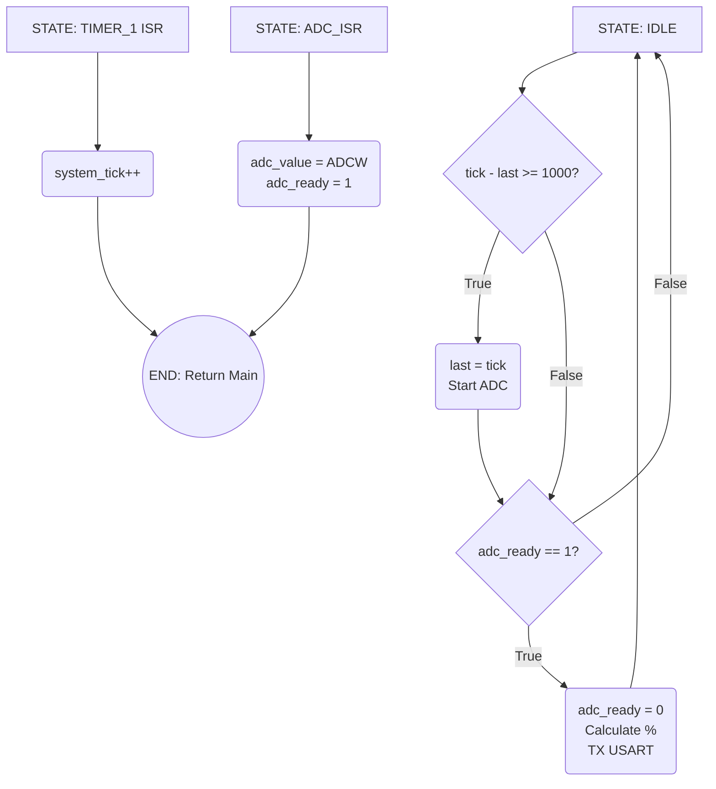

```mermaid
flowchart TD
    %% Define the shapes
    Start1[STATE: IDLE]
    CheckTimer{tick - last >= 1000?}
    UpdateTimer(last = tick <br> Start ADC)
    CheckADC{adc_ready == 1?}
    ProcessADC(adc_ready = 0 <br> Calculate % <br> TX USART)

    %% Connect the arrows
    Start1 --> CheckTimer
    
    CheckTimer -- True --> UpdateTimer
    CheckTimer -- False --> CheckADC
    UpdateTimer --> CheckADC
    
    CheckADC -- True --> ProcessADC
    CheckADC -- False --> Start1
    ProcessADC --> Start1

    %% TIMER_1 ISR Routine
    Start2[STATE: TIMER_1 ISR]
    Increase_Tick(system_tick++)
    Return_Back_Main((END: Return Main))

    Start2 --> Increase_Tick
    Increase_Tick --> Return_Back_Main
    
    %% ADC_ISR_Routine
    Start3[STATE: ADC_ISR]
    Process_ISR_ADC(adc_value = ADCW <br> adc_ready = 1)

    Start3 --> Process_ISR_ADC
    Process_ISR_ADC --> Return_Back_Main

```

